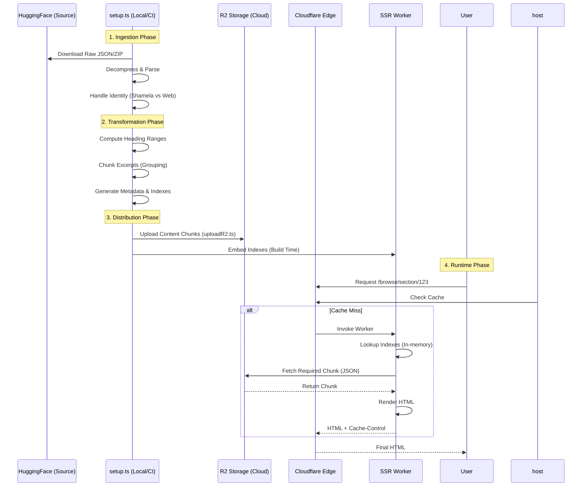

# IlmTest Architecture

This document outlines the high-level system architecture and data flow of IlmTest.

## 1. System Context Diagram

High-level view of how users interact with the system and how the system is built.

```mermaid
graph TD
    %% Actors
    User([User / Reader])
    Dev([Developer])

    %% External Systems
    HF[Hugging Face\n(Raw Datasets)]
    
    %% Infrastructure
    subgraph Cloudflare["Cloudflare Platform"]
        Edge[Cloudflare Edge Network]
        Workers[Cloudflare Workers\n(SSR Runtime)]
        Pages[Cloudflare Pages\n(Static Assets)]
        R2[(R2 Storage\nContent Chunks)]
    end

    %% Application Logic
    subgraph "Build Process"
        ETL[Build Pipeline\n(scripts/)]
        Setup[setup.ts\n(Ingest & Transform)]
        Upload[uploadR2.ts\n(Distribute)]
        Astro[Astro Build\n(SSG + Server Adaptor)]
    end

    %% Relationships - Runtime
    User -->|HTTPS Request| Edge
    Edge -->|Cache Hit| User
    Edge -->|Cache Miss| Workers
    Workers -->|Fetch Chunk| R2
    Workers -->|SSR HTML| Edge

    %% Relationships - Build
    Dev -->|git push| Pages
    Pages -->|Trigger| Astro
    Setup -->|Download| HF
    Upload -->|Upload| R2
    Setup -->|Generate JSON| Astro
    ETL --- Setup
    ETL --- Upload
```

## 2. Data Flow: The "54k Page" Architecture

Detailing how raw Islamic texts become optimized, edge-cacheable content.



### Key Components

1.  **Build Pipeline (`scripts/`)**:
    *   **`setup.ts`**: The main transformation engine. It handles disparate source types (Shamela-formatted books and Web-scraped content), computing hierarchical heading ranges and backfilling missing data.
    *   **Data Artifacts**: Generates `indexes.json` (O(1) lookups for sections, chunks, and entities), `collections.json` (library metadata), and `translators.json`.
    *   **`uploadR2.ts`**: A high-concurrency distribution script that syncs generated content chunks to Cloudflare R2, supporting resumes and skip-existing checks.

2.  **Hybrid Rendering (Astro)**:
    *   **SSG**: Landing page, About, and static collections.
    *   **SSR**: Dynamic browse/content pages (Excerpts, Sections). This architecture scales to millions of excerpts without exploding build times or file counts.

3.  **Edge Strategy**:
    *   **Caching**: SSR responses include `Cache-Control: public, s-maxage=3600, stale-while-revalidate=86400`, honored by Cloudflare Edge.
    *   **R2 Integration**: The Worker fetches granular content chunks from R2 on demand, keeping memory pressure low.
