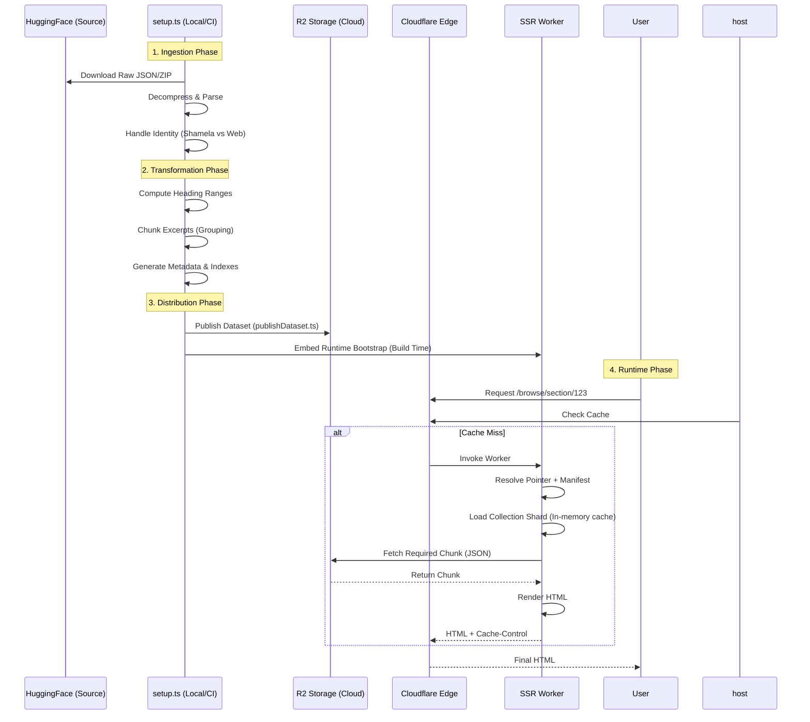

# IlmTest Architecture

This document outlines the high-level system architecture and data flow of IlmTest.

## ADRs

- [ADR 0001: Workers Is The Target Runtime](docs/adr/0001-workers-runtime.md)
- [ADR 0002: Publish Immutable Datasets](docs/adr/0002-immutable-datasets.md)
- [ADR 0003: R2 Manifest And Pointer Select The Active Dataset](docs/adr/0003-r2-manifest-pointer.md)
- [ADR 0004: Pagefind Is The Search MVP](docs/adr/0004-pagefind-search-mvp.md)
- [ADR 0005: D1 Backs Moderated Reports](docs/adr/0005-d1-reports.md)
- [ADR 0006: Inline Mentions Are Deferred](docs/adr/0006-inline-mentions-deferred.md)

## Operational Docs

- [Fixture Corpus Workflow](docs/fixtures.md)
- [QA And Observability Baseline](docs/qa.md)
- [Cloudflare Security Baseline](docs/security-baseline.md)
- [Workers Cutover](docs/runbooks/workers-cutover.md)
- [Source Continuity](docs/source-continuity.md)
- [Support Matrix](docs/support-matrix.md)

## 1. System Context Diagram

High-level view of how users interact with the system and how the system is built.

```mermaid
graph TD
    %% Actors
    User([User / Reader])
    Dev([Developer])

    %% External Systems
    HF[Hugging Face\n(Raw Datasets)]
    
    %% Infrastructure
    subgraph Cloudflare["Cloudflare Platform"]
        Edge[Cloudflare Edge Network]
        Workers[Cloudflare Workers\n(SSR Runtime)]
        Assets[Workers Static Assets\n(ASSETS Binding)]
        R2[(R2 Storage\nContent Chunks)]
    end

    %% Application Logic
    subgraph "Build Process"
        ETL[Build Pipeline\n(scripts/)]
        Setup[setup.ts\n(Ingest & Transform)]
        Publish[publishDataset.ts\n(Publish Dataset)]
        Astro[Astro Build\n(Static Assets + Worker Bundle)]
        Deploy[wrangler deploy\n(Preview / Prod)]
    end

    %% Relationships - Runtime
    User -->|HTTPS Request| Edge
    Edge -->|Cache Hit| User
    Edge -->|Cache Miss| Workers
    Workers -->|Serve Asset| Assets
    Workers -->|Fetch Chunk| R2
    Workers -->|SSR HTML| Edge

    %% Relationships - Build
    Dev -->|bun run build| Astro
    Dev -->|bun run deploy:preview / deploy:prod| Deploy
    Deploy -->|Publish Worker| Workers
    Setup -->|Download| HF
    Publish -->|Upload Immutable Dataset| R2
    Setup -->|Generate JSON| Astro
    ETL --- Setup
    ETL --- Publish
```

## 2. Data Flow: The "54k Page" Architecture

Detailing how raw Islamic texts become optimized, edge-cacheable content.



### Key Components

1.  **Build Pipeline (`scripts/`)**:
    *   **`setup.ts`**: The main transformation engine. It handles disparate source types (Shamela-formatted books and Web-scraped content), computing hierarchical heading ranges and backfilling missing data.
    *   **Data Artifacts**: Generates runtime bootstraps, runtime collection shards, chunk files, and dataset metadata for immutable publishing.
    *   **`publishDataset.ts`**: The canonical dataset publisher. It uploads immutable dataset prefixes, writes the manifest, and promotes channel pointers. `uploadR2.ts` remains legacy compatibility tooling only.

2.  **Hybrid Rendering (Astro)**:
    *   **SSG**: Landing page, About, and static collections.
    *   **SSR**: Dynamic browse/content pages (Excerpts, Sections). This architecture scales to millions of excerpts without exploding build times or file counts.

3.  **Edge Strategy**:
    *   **Caching**: SSR responses include `Cache-Control: public, s-maxage=3600, stale-while-revalidate=86400`, honored by Cloudflare Edge.
    *   **R2 Integration**: The Worker fetches granular content chunks from R2 on demand, keeping memory pressure low.

## 3. M0-M1 Dataset Control Plane

The current request path still uses bundled `src/data/*.json` plus legacy flat chunk lookups. During `M0-M1`, the repo adds a separate dataset control plane without changing live route behavior:

- `setup.ts` now emits `tmp/dataset-build/metadata.json` as the publishing input contract.
- Immutable datasets publish under `datasets/<datasetVersion>/...`.
- `channels/prod.json` and `channels/preview.json` select the active dataset manifest for the future runtime path.
- Corpus publishing, code deployment, and dataset promotion are now separate release lanes.

## 4. M2 Fixture And Integrity Layer

Before the runtime switches to manifest-selected datasets, the repo now supports fixture-driven validation:

- `test/fixtures/tiny/` defines the PR-safe corpus used in contributor CI.
- `test/fixtures/medium/` defines the larger maintainer corpus used for manual validation.
- `scripts/checkIntegrity.ts` verifies route inputs, chunk mappings, dataset metadata, and curated-reference integrity.
- `scripts/smokeRoutes.ts` exercises representative pages against a live Astro dev server without production secrets.

## 5. M3 Runtime Data Plane

The browse, profile, and sitemap surfaces now resolve corpus data through version-aware runtime artifacts instead of relying on bundled monolithic indexes:

- `src/lib/runtimeLoader.ts` resolves the active channel pointer and dataset manifest.
- `src/lib/data.ts` loads bundle-sized bootstraps plus manifest-selected collection shards.
- `src/lib/excerptChunks.ts` fetches chunk payloads by dataset version at runtime.
- `src/lib/runtimeCache.ts` keeps pointer, manifest, and hot artifact shards in per-isolate memory.
- `src/lib/runtimeSignals.ts` emits structured `[runtime]` logs for route loads, artifact loads, and chunk fetches.

Operational checks for this layer are:

- `bun run bundle-check`
- `bun run smoke-routes`
- `bun run runtime-probe`

## 6. M4 Workers Cutover

The app runtime now deploys through Cloudflare Workers only:

- `bun run deploy:prod` builds and deploys the production Worker.
- `bun run deploy:preview` builds and deploys the shared preview Worker.
- `bun run deploy-check` validates the generated Worker bundle plus asset binding through `wrangler deploy --dry-run`.
- Preview and production select `preview.json` vs `prod.json` through explicit Wrangler environment variables, not just hostname heuristics.
