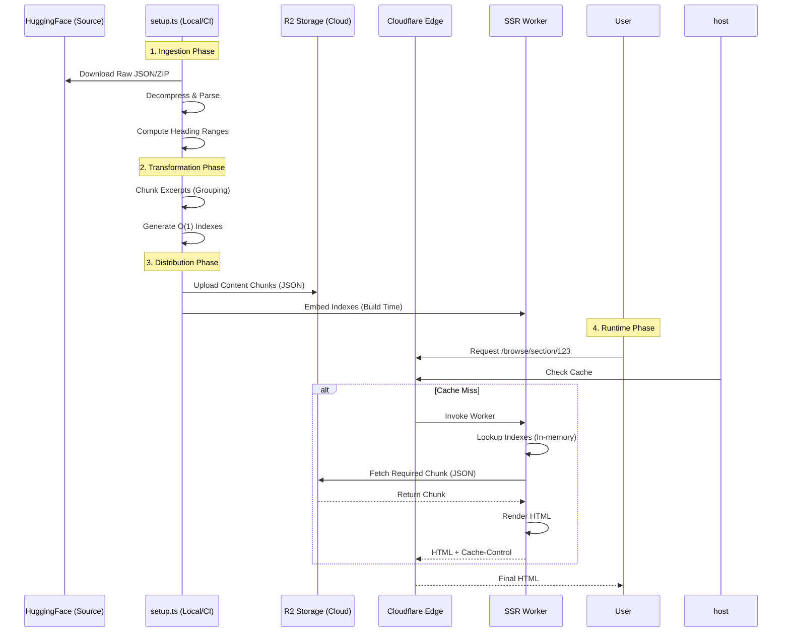

# IlmTest Architecture

This document outlines the high-level system architecture and data flow of IlmTest.

## 1. System Context Diagram

High-level view of how users interact with the system and how the system is built.

```mermaid
graph TD
    %% Actors
    User([User / Reader])
    Dev([Developer])

    %% External Systems
    HF[Hugging Face\n(Raw Datasets)]
    
    %% Infrastructure
    subgraph Cloudflare["Cloudflare Platform"]
        Edge[Cloudflare Edge Network]
        Workers[Cloudflare Workers\n(SSR Runtime)]
        Pages[Cloudflare Pages\n(Static Assets)]
        R2[(R2 Storage\nContent Chunks)]
    end

    %% Application Logic
    subgraph "Build Process"
        Setup[setup.ts\n(ETL Pipeline)]
        Astro[Astro Build\n(SSG + Server Adaptor)]
    end

    %% Relationships - Runtime
    User -->|HTTPS Request| Edge
    Edge -->|Cache Hit| User
    Edge -->|Cache Miss| Workers
    Workers -->|Fetch Chunk| R2
    Workers -->|SSR HTML| Edge

    %% Relationships - Build
    Dev -->|git push| Pages
    Pages -->|Trigger| Astro
    Setup -->|Download| HF
    Setup -->|Upload| R2
    Setup -->|Generate| Astro
```

## 2. Data Flow: The "54k Page" Architecture

Detailing how raw Islamic texts become optimized, edge-cacheable content.



### Key Components

1.  **ETL Pipeline (`setup.ts`)**:
    *   Runs before the main build.
    *   Transforms massive raw datasets into small, accessible "Chunks".
    *   Generates `indexes.json` for O(1) lookups, avoiding massive array scans at runtime.

2.  **Hybrid Rendering**:
    *   **SSG**: Landing page, About, TOCs.
    *   **SSR**: Content pages (Excerpts, Sections). This avoids building 54k static files.

3.  **Caching Strategy**:
    *   SSR responses include `Cache-Control: public, s-maxage=3600, stale-while-revalidate=86400`.
    *   Cloudflare Edge honors this, serving subsequent requests instantly without invoking the Worker.
